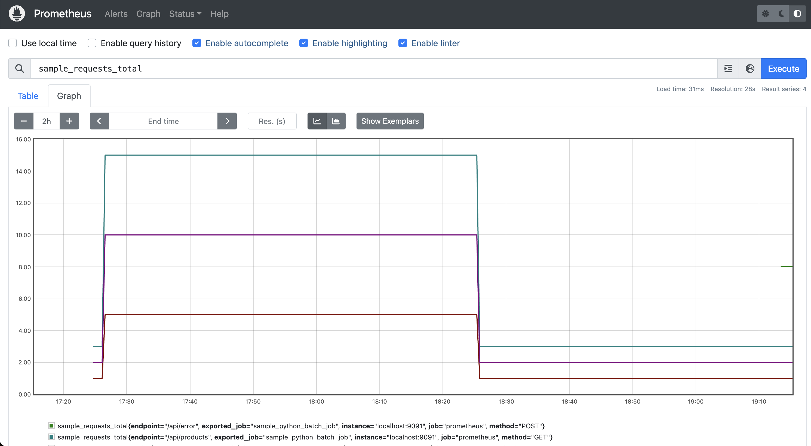

# Proxying Prometheus metrics to Push Gateway

```
Desktop Application --> Proxy Server --> Prometheus Pushgateway <-- Prometheus Metrics Server
```

## Usage

### Start Prometheus servers

Start a Prometheus PushGateway server by executing the binary from official github repo [here](https://github.com/Prometheus/pushgateway?tab=readme-ov-file#run-it).

NOTE: This should start a running instance by default on `localhost:9091`.

Start a Prometheus Metrics collection server by [downloading](https://prometheus.io/docs/prometheus/latest/getting_started/#getting-started) and starting with the [`sample_prometheus_server_config.yml`](sample_prometheus_server_config.yml).

NOTE: The default server port is on `localhost:9090`, metrics can be inspected via: http://localhost:9090/graph.

### Start proxy server

Start proxy server with flask: `python server.py`.

### Start lint server

Build and start go server for leveraging Prometheus library code for linting metrics plaintext.

```
cd metrics-lint-server
go build -o metriclint_server metriclist_server.go
./metric_lint_server
```

NOTE: The above opens a port on `localhost:8080` by default, accepting a PUT request via `/lint`.

### Execute client to test logging metrics

Execute a test client session using: `python client.py`.

## Why?

Client logs can be noisy and direct access to the gateway server may not be available from the client-side (due to e.g. security authorization requirements).

Adding a proxy server layer allows us to perform the following:
1. Guard against malformed traffic requests
2. Prevent unauthorized logging of metrics
3. Perform error checking and validation on metrics payload

## Objective

**Allow client applications to perform metric pushes into Prometheus Gateway server via a proxy server that we own.**

## Design

### Custom request handler

Prometheus Push Gateway allows passing a handler to wrap around requests to push metrics data, defined by the optional `handler` field in [`push_to_gateway`](https://github.com/prometheus/client_python/blob/e3902ea45b4bfbaf6ff1d10c3889107e6c8f51fc/prometheus_client/exposition.py#L514).

```
def push_to_gateway(
        gateway: str,
        job: str,
        registry: CollectorRegistry,
        grouping_key: Optional[Dict[str, Any]] = None,
        timeout: Optional[float] = 30,
        handler: Callable = default_handler,
) -> None:
    """Push metrics to the given pushgateway.

    `gateway` the url for your push gateway. Either of the form
              'http://pushgateway.local', or 'pushgateway.local'.
              Scheme defaults to 'http' if none is provided
    `job` is the job label to be attached to all pushed metrics
    `registry` is an instance of CollectorRegistry
    `grouping_key` please see the pushgateway documentation for details.
                   Defaults to None
    `timeout` is how long push will attempt to connect before giving up.
              Defaults to 30s, can be set to None for no timeout.
    `handler` is an optional function which can be provided to perform
              requests to the 'gateway'.
              Defaults to None, in which case an http or https request
              will be carried out by a default handler.
              If not None, the argument must be a function which accepts
              the following arguments:
              url, method, timeout, headers, and content
              May be used to implement additional functionality not
              supported by the built-in default handler (such as SSL
              client certicates, and HTTP authentication mechanisms).
              'url' is the URL for the request, the 'gateway' argument
              described earlier will form the basis of this URL.
              'method' is the HTTP method which should be used when
              carrying out the request.
              'timeout' requests not successfully completed after this
              many seconds should be aborted.  If timeout is None, then
              the handler should not set a timeout.
              'headers' is a list of ("header-name","header-value") tuples
              which must be passed to the pushgateway in the form of HTTP
              request headers.
              The function should raise an exception (e.g. IOError) on
              failure.
              'content' is the data which should be used to form the HTTP
              Message Body.

    This overwrites all metrics with the same job and grouping_key.
    This uses the PUT HTTP method."""
    _use_gateway('PUT', gateway, job, registry, grouping_key, timeout, handler)
```

### What gets sent as metrics?

Example trace in Prometheus metrics format

```
# HELP sample_requests_total Total number of requests processed
# TYPE sample_requests_total counter
sample_requests_total{endpoint="/api/users",method="GET"} 1.0
sample_requests_total{endpoint="/api/users",method="POST"} 2.0
sample_requests_total{endpoint="/api/products",method="GET"} 3.0
# HELP sample_requests_created Total number of requests processed
# TYPE sample_requests_created gauge
sample_requests_created{endpoint="/api/users",method="GET"} 1.746471551877036e+09
sample_requests_created{endpoint="/api/users",method="POST"} 1.746471551877043e+09
sample_requests_created{endpoint="/api/products",method="GET"} 1.746471551877047e+09
# HELP sample_cpu_usage_percent Current CPU usage in percent
# TYPE sample_cpu_usage_percent gauge
sample_cpu_usage_percent 39.42813246935317
# HELP sample_memory_usage_bytes Current memory usage in bytes
# TYPE sample_memory_usage_bytes gauge
sample_memory_usage_bytes{instance="app-server-1"} 2.90548674e+08
# HELP sample_request_duration_seconds Request duration in seconds
# TYPE sample_request_duration_seconds histogram
sample_request_duration_seconds_bucket{endpoint="/api/users",le="0.05"} 0.0
sample_request_duration_seconds_bucket{endpoint="/api/users",le="0.1"} 0.0
sample_request_duration_seconds_bucket{endpoint="/api/users",le="0.25"} 1.0
sample_request_duration_seconds_bucket{endpoint="/api/users",le="0.5"} 1.0
sample_request_duration_seconds_bucket{endpoint="/api/users",le="1.0"} 1.0
sample_request_duration_seconds_bucket{endpoint="/api/users",le="2.5"} 1.0
sample_request_duration_seconds_bucket{endpoint="/api/users",le="5.0"} 1.0
sample_request_duration_seconds_bucket{endpoint="/api/users",le="10.0"} 1.0
sample_request_duration_seconds_bucket{endpoint="/api/users",le="+Inf"} 1.0
sample_request_duration_seconds_count{endpoint="/api/users"} 1.0
sample_request_duration_seconds_sum{endpoint="/api/users"} 0.1477690413594246
sample_request_duration_seconds_bucket{endpoint="/api/products",le="0.05"} 0.0
sample_request_duration_seconds_bucket{endpoint="/api/products",le="0.1"} 0.0
sample_request_duration_seconds_bucket{endpoint="/api/products",le="0.25"} 0.0
sample_request_duration_seconds_bucket{endpoint="/api/products",le="0.5"} 0.0
sample_request_duration_seconds_bucket{endpoint="/api/products",le="1.0"} 1.0
sample_request_duration_seconds_bucket{endpoint="/api/products",le="2.5"} 1.0
sample_request_duration_seconds_bucket{endpoint="/api/products",le="5.0"} 1.0
sample_request_duration_seconds_bucket{endpoint="/api/products",le="10.0"} 1.0
sample_request_duration_seconds_bucket{endpoint="/api/products",le="+Inf"} 1.0
sample_request_duration_seconds_count{endpoint="/api/products"} 1.0
sample_request_duration_seconds_sum{endpoint="/api/products"} 0.6612882476396624
# HELP sample_request_duration_seconds_created Request duration in seconds
# TYPE sample_request_duration_seconds_created gauge
sample_request_duration_seconds_created{endpoint="/api/users"} 1.7464715518770628e+09
sample_request_duration_seconds_created{endpoint="/api/products"} 1.746471552025109e+09
# HELP sample_request_latency_seconds Request latency in seconds
# TYPE sample_request_latency_seconds summary
sample_request_latency_seconds_count 1.0
sample_request_latency_seconds_sum 0.17788633378222585
# HELP sample_request_latency_seconds_created Request latency in seconds
# TYPE sample_request_latency_seconds_created gauge
sample_request_latency_seconds_created 1.746471551876989e+09
# HELP sample_job_last_success_unixtime Last time the batch job successfully finished
# TYPE sample_job_last_success_unixtime gauge
sample_job_last_success_unixtime 1.7464715532050078e+09
# HELP sample_job_duration_seconds Duration of the batch job in seconds
# TYPE sample_job_duration_seconds gauge
sample_job_duration_seconds 1.3280010223388672
```

### Prometheus metrics server visualization



## Implementation

Clients should specify a function that returns a callable function that sends a http request with metrics data and gateway target url.

Original referenced implementation of the `default_handler` used internally by `_use_gateway()`: [`_make_handler`](https://github.com/prometheus/client_python/blob/e3902ea45b4bfbaf6ff1d10c3889107e6c8f51fc/prometheus_client/exposition.py#L393)

```py
def proxy_handler(
        url: str,
        method: str,
        timeout: Optional[float],
        headers: Sequence[Tuple[str, str]],
        data: bytes,
        base_handler:Optional[Union[BaseHandler, type]] = HTTPHandler,
) -> Callable[[], None]:
    """Proxy handler to forward requests to the Pushgateway"""
    def handle() -> None:
        # Create a payload containing both target URL and encoded data
        # payload = {
        #     "target_url": url,        # Gateway url with join keys embedded in http args
        #     "method": method,         # GET, PUT, POST
        #     "headers": dict(headers), # Forwarded request headers (from prometheus_client lib)
        #     "data": encoded_data,     # Actual metrics data
        # }
        pass

    return handle
```

### Authorization guardrails

Prometheus gateway server should be guarded behind some authorization - which would be handled by the deployment endpoint. Auth to scrape from the configured push gateway server can be done by specifying in the `basic_auth` in `scrape_configs` under `sample_prometheus_server_config.yml` (or where the main prometheus metrics server is running).

### Error checking & Metrics Validation

We perform 2 kinds of error checking:

1. Prometheus Lint tool (exposed in Prometheus' [client_golang](https://github.com/prometheus/client_golang/blob/main/prometheus/testutil/promlint/promlint.go)). Which test for proper formatting of the metrics plaintext dump.
2. Afterwards, we parse the given plaintext and extract a dictionary of Metrics using the python_client library: [`from prometheus_client.parser import text_string_to_metric_families`](https://github.com/prometheus/client_python/blob/e3902ea45b4bfbaf6ff1d10c3889107e6c8f51fc/prometheus_client/parser.py). Which allows us to perform additional assertions/checks on the expected list of metrics to be logged.

See function `validate_metric_properties` for adding validations on top of the contents of Metric properties.

#### Request Validation

2 main sources of information is parsed from the incoming request:

1. `target_url`: gateway url as configured by the client (main information is join keys formatting which is done by the `prometheus_client` library)
2. `data`: encoded data bytes which produces a serialized version of the 

## Limitations

Each instance of `push_to_gateway` will overwrite existing metrics per session (defined by unique 'job' identifiers). However, metrics can still be aggregated across multiple sessions based on the field labels.

E.g. aggregating all counts of query endpoint usage per user given ID field:

```
sum by (endpoint, userid, method, job) (sample_requests_total)
```

### Push Gateway usage

https://prometheus.io/docs/practices/pushing/#should-i-be-using-the-pushgateway

Pushed metrics for a given job/metric name will be persistent and exposed via `gateway_url/metrics` to be pulled by Prometheus metrics collector service. This means we will always be caching the latest client metrics if we use Push Gateway.

### tl;dr

**Each log instance should be differentiated with a unique `<userid, session_key>` combination.**
